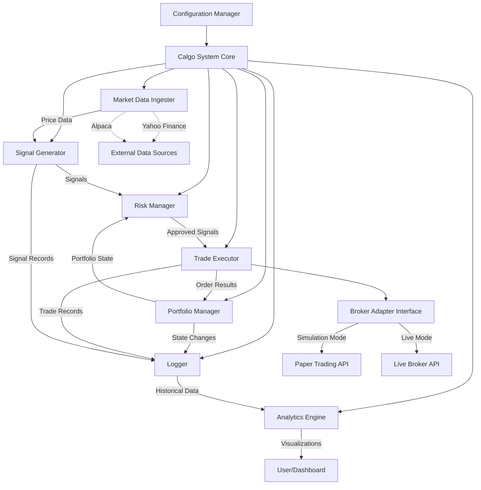

# Design Document: Calgo AI-Driven Trading Bot

## Overview

Calgo is an AI-driven autonomous trading bot designed for simulated stock and ETF trading with a modular architecture that supports future live trading with minimal modifications. The system operates continuously during market hours, fetching market data, generating AI-powered trading signals, managing portfolio positions, executing trades through abstracted broker APIs, and enforcing comprehensive risk management controls.

The core design philosophy emphasizes:
- **Modularity**: Each component has a single responsibility and can be modified independently
- **Abstraction**: Broker APIs are abstracted to enable seamless switching between paper and live trading
- **Extensibility**: New AI models and data sources can be added without modifying core logic
- **Safety**: Risk management operates uniformly across all execution modes
- **Observability**: Comprehensive logging and analytics enable performance analysis and debugging

The system follows a pipeline architecture where market data flows through signal generation, risk evaluation, trade execution, and portfolio updates, with all state changes logged for analytics.

## Architecture

### System Architecture Diagram



### Component Responsibilities

**Configuration Manager**
- Loads and validates configuration from file at startup
- Provides configuration access to all system components
- Validates configuration completeness and correctness

**Calgo System Core**
- Orchestrates the main trading loop
- Coordinates component interactions
- Manages autonomous operation and error handling
- Controls system lifecycle (startup, operation, shutdown)

**Market Data Ingester**
- Fetches historical and real-time price data from multiple sources
- Normalizes data into consistent internal format
- Handles data source failover
- Validates data completeness and quality

**Signal Generator**
- Generates buy/sell/hold signals using AI models
- Supports multiple model types (moving averages, ML classifiers, RL agents)
- Enables runtime model selection and multi-model aggregation
- Produces signals with confidence levels

**Portfolio Manager**
- Tracks all open and closed positions
- Calculates realized and unrealized P&L
- Enforces portfolio and position size limits
- Maintains current allocation and risk metrics
- Provides portfolio snapshots on demand

**Trade Executor**
- Abstracts broker API interactions through Broker Adapter interface
- Routes orders to paper or live APIs based on execution mode
- Returns order confirmations with execution details
- Handles order failures with descriptive errors

**Risk Manager**
- Enforces stop-loss and take-profit thresholds
- Validates position sizing against portfolio limits
- Monitors portfolio drawdown
- Triggers protective sell signals when thresholds are breached
- Halts trading when maximum drawdown is exceeded

**Logger**
- Records all trades with complete execution details
- Records portfolio state changes with snapshots
- Records generated signals with metadata
- Persists logs to durable storage

**Analytics Engine**
- Generates P&L time-series visualizations
- Calculates performance metrics (cumulative returns, Sharpe ratio, max drawdown)
- Visualizes position allocations
- Provides per-model performance tracking

### Data Flow

1. **Market Data Acquisition**: Market Data Ingester fetches price data at configured intervals
2. **Signal Generation**: Signal Generator processes market data and produces trading signals
3. **Risk Evaluation**: Risk Manager evaluates signals against current portfolio state and risk limits
4. **Trade Execution**: Trade Executor submits approved orders through Broker Adapter
5. **Portfolio Update**: Portfolio Manager updates positions and metrics based on execution results
6. **Logging**: Logger records all state changes, trades, and signals
7. **Analytics**: Analytics Engine processes historical logs to generate insights

### Error Handling Strategy

- **Data Source Failures**: Automatic failover to alternative configured sources
- **Order Failures**: Descriptive error logging and continuation of operation
- **Critical Errors**: System halt, error logging, and alert notification
- **Configuration Errors**: Fail-fast at startup with descriptive messages
- **Parsing Errors**: Descriptive error messages indicating failure location and nature

## Components and Interfaces

### Configuration Manager

**Interface:**
```python
class ConfigurationManager:
    def load_config(file_path: str) -> Config
    def validate_config(config: Config) -> Result[Config, ConfigError]
    def get_execution_mode() -> ExecutionMode
    def get_data_sources() -> List[DataSourceConfig]
    def get_risk_params() -> RiskParameters
    def get_active_models() -> List[ModelConfig]
    def get_trading_schedule() -> TradingSchedule
```

**Responsibilities:**
- Parse configuration file (JSON/YAML)
- Validate all required fields are present
- Validate parameter ranges and constraints
- Provide typed access to configuration values

### Market Data Ingester

**Interface:**
```python
class MarketDataIngester:
    def fetch_historical(symbol: str, start_date: datetime, end_date: datetime) -> Result[PriceData, DataError]
    def fetch_realtime(symbol: str) -> Result[PriceData, DataError]
    def normalize_data(raw_data: Any, source: DataSource) -> PriceData
    def validate_data(data: PriceData) -> Result[PriceData, ValidationError]
    def add_data_source(source: DataSource) -> None
```

**Data Sources:**
- Yahoo Finance API
- Alpaca Market Data API
- Extensible to additional sources

**Normalization:**
All price data normalized to:
```python
@dataclass
class PriceData:
    symbol: str
    timestamp: datetime
    open: Decimal
    high: Decimal
    low: Decimal
    close: Decimal
    volume: int
    source: DataSource
```

### Signal Generator

**Interface:**
```python
class SignalGenerator:
    def generate_signal(market_data: PriceData, portfolio_state: PortfolioSnapshot) -> Signal
    def add_model(model: TradingModel) -> None
    def remove_model(model_id: str) -> None
    def set_active_models(model_ids: List[str]) -> None
    def aggregate_signals(signals: List[Signal]) -> Signal
```

**Signal Structure:**
```python
@dataclass
class Signal:
    symbol: str
    timestamp: datetime
    recommendation: Recommendation  # BUY, SELL, HOLD
    confidence: float  # 0.0 to 1.0
    model_id: str
    metadata: Dict[str, Any]
```

**Model Interface:**
```python
class TradingModel(ABC):
    @abstractmethod
    def predict(market_data: PriceData, portfolio_state: PortfolioSnapshot) -> Signal
    
    @abstractmethod
    def get_model_id() -> str
```

**Aggregation Strategies:**
- **Voting**: Majority recommendation wins
- **Weighted Average**: Confidence-weighted recommendation
- **Ensemble**: Custom aggregation logic per model combination

### Portfolio Manager

**Interface:**
```python
class PortfolioManager:
    def add_position(symbol: str, quantity: int, entry_price: Decimal) -> Result[Position, PortfolioError]
    def close_position(symbol: str, exit_price: Decimal) -> Result[ClosedPosition, PortfolioError]
    def update_position(symbol: str, current_price: Decimal) -> None
    def get_position(symbol: str) -> Option[Position]
    def get_all_positions() -> List[Position]
    def get_snapshot() -> PortfolioSnapshot
    def calculate_unrealized_pnl() -> Decimal
    def calculate_realized_pnl() -> Decimal
    def get_allocation(symbol: str) -> Decimal  # Percentage
    def get_total_value() -> Decimal
    def check_position_limit(symbol: str, quantity: int) -> bool
    def check_portfolio_limit(value: Decimal) -> bool
```

**Position Tracking:**
```python
@dataclass
class Position:
    symbol: str
    quantity: int
    entry_price: Decimal
    current_price: Decimal
    entry_timestamp: datetime
    unrealized_pnl: Decimal
    
@dataclass
class ClosedPosition:
    symbol: str
    quantity: int
    entry_price: Decimal
    exit_price: Decimal
    entry_timestamp: datetime
    exit_timestamp: datetime
    realized_pnl: Decimal
```

### Trade Executor

**Interface:**
```python
class TradeExecutor:
    def __init__(execution_mode: ExecutionMode, broker_adapter: BrokerAdapter)
    def submit_order(order: Order) -> Result[OrderConfirmation, OrderError]
    def cancel_order(order_id: str) -> Result[CancelConfirmation, OrderError]
    def get_order_status(order_id: str) -> OrderStatus
```

**Broker Adapter Interface:**
```python
class BrokerAdapter(ABC):
    @abstractmethod
    def place_order(symbol: str, quantity: int, action: OrderAction, order_type: OrderType) -> Result[OrderConfirmation, OrderError]
    
    @abstractmethod
    def cancel_order(order_id: str) -> Result[CancelConfirmation, OrderError]
    
    @abstractmethod
    def get_order_status(order_id: str) -> OrderStatus
```

**Order Structures:**
```python
@dataclass
class Order:
    symbol: str
    quantity: int
    action: OrderAction  # BUY, SELL
    order_type: OrderType  # MARKET, LIMIT
    limit_price: Optional[Decimal]
    
@dataclass
class OrderConfirmation:
    order_id: str
    symbol: str
    quantity: int
    execution_price: Decimal
    timestamp: datetime
    status: OrderStatus
```

**Execution Modes:**
- **Simulation**: Routes to paper trading API (Alpaca Paper)
- **Live**: Routes to live broker API (Alpaca Live, Interactive Brokers, etc.)

### Risk Manager

**Interface:**
```python
class RiskManager:
    def __init__(risk_params: RiskParameters)
    def evaluate_signal(signal: Signal, portfolio: PortfolioSnapshot) -> Result[ApprovedSignal, RiskViolation]
    def check_stop_loss(position: Position) -> bool
    def check_take_profit(position: Position) -> bool
    def check_position_size(symbol: str, quantity: int, portfolio: PortfolioSnapshot) -> bool
    def check_drawdown(portfolio: PortfolioSnapshot) -> bool
    def generate_protective_signals(portfolio: PortfolioSnapshot) -> List[Signal]
    def is_trading_halted() -> bool
```

**Risk Parameters:**
```python
@dataclass
class RiskParameters:
    stop_loss_pct: Decimal  # e.g., 0.05 for 5% loss
    take_profit_pct: Decimal  # e.g., 0.10 for 10% gain
    max_position_size_pct: Decimal  # e.g., 0.20 for 20% of portfolio
    max_drawdown_pct: Decimal  # e.g., 0.15 for 15% drawdown
    max_portfolio_value: Decimal
```

**Risk Violations:**
```python
class RiskViolation(Enum):
    STOP_LOSS_BREACHED
    TAKE_PROFIT_REACHED
    POSITION_SIZE_EXCEEDED
    PORTFOLIO_LIMIT_EXCEEDED
    DRAWDOWN_LIMIT_EXCEEDED
```

### Logger

**Interface:**
```python
class Logger:
    def log_trade(trade: TradeRecord) -> None
    def log_portfolio_change(snapshot: PortfolioSnapshot) -> None
    def log_signal(signal: Signal) -> None
    def log_error(error: SystemError) -> None
    def get_trade_history(start_date: datetime, end_date: datetime) -> List[TradeRecord]
    def get_portfolio_history(start_date: datetime, end_date: datetime) -> List[PortfolioSnapshot]
    def get_signal_history(start_date: datetime, end_date: datetime) -> List[Signal]
```

**Log Structures:**
```python
@dataclass
class TradeRecord:
    timestamp: datetime
    order_id: str
    symbol: str
    action: OrderAction
    quantity: int
    execution_price: Decimal
    
@dataclass
class PortfolioSnapshot:
    timestamp: datetime
    positions: List[Position]
    total_value: Decimal
    cash_balance: Decimal
    unrealized_pnl: Decimal
    realized_pnl: Decimal
    drawdown: Decimal
```

**Storage:**
- JSON format for structured logs
- File-based storage with rotation
- Indexed by timestamp for efficient queries

### Analytics Engine

**Interface:**
```python
class AnalyticsEngine:
    def __init__(logger: Logger)
    def generate_pnl_chart(start_date: datetime, end_date: datetime) -> Chart
    def generate_allocation_chart(timestamp: datetime) -> Chart
    def calculate_cumulative_returns(start_date: datetime, end_date: datetime) -> Decimal
    def calculate_sharpe_ratio(start_date: datetime, end_date: datetime) -> Decimal
    def calculate_max_drawdown(start_date: datetime, end_date: datetime) -> Decimal
    def get_model_performance(model_id: str, start_date: datetime, end_date: datetime) -> ModelMetrics
```

**Performance Metrics:**
```python
@dataclass
class ModelMetrics:
    model_id: str
    total_signals: int
    profitable_signals: int
    win_rate: Decimal
    average_return: Decimal
    sharpe_ratio: Decimal
```

## Data Models

### Core Domain Models

**ExecutionMode:**
```python
class ExecutionMode(Enum):
    SIMULATION = "simulation"
    LIVE = "live"
```

**Recommendation:**
```python
class Recommendation(Enum):
    BUY = "buy"
    SELL = "sell"
    HOLD = "hold"
```

**OrderAction:**
```python
class OrderAction(Enum):
    BUY = "buy"
    SELL = "sell"
```

**OrderType:**
```python
class OrderType(Enum):
    MARKET = "market"
    LIMIT = "limit"
```

**OrderStatus:**
```python
class OrderStatus(Enum):
    PENDING = "pending"
    FILLED = "filled"
    PARTIALLY_FILLED = "partially_filled"
    CANCELLED = "cancelled"
    REJECTED = "rejected"
```

**DataSource:**
```python
class DataSource(Enum):
    YAHOO_FINANCE = "yahoo_finance"
    ALPACA = "alpaca"
```

### Configuration Model

```python
@dataclass
class Config:
    execution_mode: ExecutionMode
    data_sources: List[DataSourceConfig]
    risk_parameters: RiskParameters
    active_models: List[ModelConfig]
    trading_schedule: TradingSchedule
    broker_config: BrokerConfig
    logging_config: LoggingConfig
    
@dataclass
class DataSourceConfig:
    source: DataSource
    api_key: str
    priority: int  # Lower number = higher priority
    
@dataclass
class ModelConfig:
    model_id: str
    model_type: str
    parameters: Dict[str, Any]
    enabled: bool
    
@dataclass
class TradingSchedule:
    market_open: time
    market_close: time
    data_fetch_interval_seconds: int
    trading_days: List[str]  # e.g., ["MON", "TUE", "WED", "THU", "FRI"]
    
@dataclass
class BrokerConfig:
    broker_name: str
    api_key: str
    api_secret: str
    base_url: str
    
@dataclass
class LoggingConfig:
    log_directory: str
    log_level: str
    rotation_policy: str
```

### System State Models

**System State Machine:**
```
INITIALIZING -> READY -> RUNNING -> HALTED -> SHUTDOWN
                  ^         |
                  |_________|
```

States:
- **INITIALIZING**: Loading configuration, initializing components
- **READY**: All components initialized, waiting to start trading loop
- **RUNNING**: Active trading loop executing
- **HALTED**: Trading stopped due to risk violation or error, monitoring continues
- **SHUTDOWN**: System shutting down gracefully

### Data Persistence Models

All persistent data serialized to JSON format with the following schemas:

**Trade Log Entry:**
```json
{
  "timestamp": "2024-01-15T10:30:00Z",
  "order_id": "ORD-12345",
  "symbol": "AAPL",
  "action": "buy",
  "quantity": 10,
  "execution_price": "150.25"
}
```

**Portfolio Snapshot Entry:**
```json
{
  "timestamp": "2024-01-15T10:30:00Z",
  "positions": [
    {
      "symbol": "AAPL",
      "quantity": 10,
      "entry_price": "150.25",
      "current_price": "151.00",
      "entry_timestamp": "2024-01-15T10:30:00Z",
      "unrealized_pnl": "7.50"
    }
  ],
  "total_value": "10000.00",
  "cash_balance": "8497.50",
  "unrealized_pnl": "7.50",
  "realized_pnl": "0.00",
  "drawdown": "0.00"
}
```

**Signal Log Entry:**
```json
{
  "symbol": "AAPL",
  "timestamp": "2024-01-15T10:29:55Z",
  "recommendation": "buy",
  "confidence": 0.85,
  "model_id": "ma_crossover_v1",
  "metadata": {
    "short_ma": 149.50,
    "long_ma": 148.00
  }
}
```


## Correctness Properties

A property is a characteristic or behavior that should hold true across all valid executions of a system-essentially, a formal statement about what the system should do. Properties serve as the bridge between human-readable specifications and machine-verifiable correctness guarantees.

### Property 1: Historical Data Retrieval Completeness

For any valid symbol and time range, when a historical data fetch request is made, the Market_Data_Ingester should return price data covering the requested period or return a descriptive error.

**Validates: Requirements 1.2**

### Property 2: Data Source Failover

For any data fetch request, if the primary data source fails or is unavailable, the Market_Data_Ingester should automatically attempt to fetch from the next configured alternative source.

**Validates: Requirements 1.4**

### Property 3: Data Normalization Consistency

For any price data from any supported source, the Market_Data_Ingester should normalize it into the standard PriceData format with all required fields (symbol, timestamp, open, high, low, close, volume).

**Validates: Requirements 1.5**

### Property 4: Data Validation Flags Invalid Data

For any price data with missing or invalid data points (e.g., negative prices, missing timestamps), the Market_Data_Ingester should flag these issues and return a validation error.

**Validates: Requirements 1.6**

### Property 5: Signal Structure Completeness

For any market data input, the Signal_Generator should produce a Signal containing all required fields: symbol, timestamp, recommendation (buy/sell/hold), confidence level (0.0-1.0), and model_id.

**Validates: Requirements 2.2**

### Property 6: Signal Logging Completeness

For any generated signal, the Logger should record it with all required metadata: timestamp, symbol, recommendation, confidence level, and model identifier.

**Validates: Requirements 2.6**

### Property 7: Position Tracking Completeness

For any open position, the Portfolio_Manager should track all required fields: symbol, quantity, entry_price, current_price, entry_timestamp, and unrealized_pnl.

**Validates: Requirements 3.1**

### Property 8: Realized P&L Calculation Correctness

For any closed position, the realized P&L should equal (exit_price - entry_price) × quantity, accounting for the direction of the trade (buy then sell, or sell then buy).

**Validates: Requirements 3.2**

### Property 9: Portfolio Size Limit Enforcement

For any operation that would cause the total portfolio value to exceed the configured maximum portfolio size limit, the Portfolio_Manager should reject the operation.

**Validates: Requirements 3.3**

### Property 10: Position Size Limit Enforcement

For any position where the value (quantity × price) would exceed the configured maximum position size percentage of total portfolio value, the Portfolio_Manager should reject the operation.

**Validates: Requirements 3.4**

### Property 11: Portfolio Allocation Sum Invariant

For any portfolio snapshot, the sum of all position allocation percentages should equal 100% (or 0% if no positions exist), and each individual allocation should equal (position_value / total_portfolio_value) × 100.

**Validates: Requirements 3.5**

### Property 12: Risk Metrics Update on State Change

For any portfolio state change (position added, closed, or updated), the Portfolio_Manager should recalculate and update all risk metrics including current drawdown and total exposure.

**Validates: Requirements 3.6**

### Property 13: Portfolio Snapshot Completeness

For any portfolio snapshot request, the returned snapshot should contain all open positions and all required metrics: total_value, cash_balance, unrealized_pnl, realized_pnl, and drawdown.

**Validates: Requirements 3.7**

### Property 14: Order Confirmation Completeness

For any successfully submitted order, the Trade_Executor should return an OrderConfirmation containing all required fields: order_id, symbol, quantity, execution_price, timestamp, and status.

**Validates: Requirements 4.6**

### Property 15: Order Failure Logging

For any failed order submission, the Trade_Executor should return a descriptive error message and log the failure with timestamp and error details.

**Validates: Requirements 4.7**

### Property 16: Trade Logging Completeness

For any executed trade, the Logger should record a TradeRecord containing all required fields: timestamp, order_id, symbol, action, quantity, and execution_price.

**Validates: Requirements 5.1**

### Property 17: Portfolio State Change Logging Completeness

For any portfolio state change, the Logger should record a complete PortfolioSnapshot with timestamp and all current positions.

**Validates: Requirements 5.2**

### Property 18: Signal Logging Completeness

For any generated signal, the Logger should record it with all required fields: timestamp, symbol, recommendation, and confidence level.

**Validates: Requirements 5.3**

### Property 19: Performance Metrics Calculation Correctness

For any time period with trade history, the Analytics_Engine should calculate cumulative returns as (final_value - initial_value) / initial_value, Sharpe ratio as mean(returns) / std(returns) × sqrt(periods), and maximum drawdown as the largest peak-to-trough decline.

**Validates: Requirements 5.7**

### Property 20: Signal Aggregation Strategy Correctness

For any set of signals from multiple models, the aggregated signal should follow the configured aggregation strategy: voting (majority wins), weighted average (confidence-weighted), or custom ensemble logic.

**Validates: Requirements 6.5**

### Property 21: Per-Model Performance Metric Independence

For any model, its performance metrics (win rate, average return, Sharpe ratio) should be calculated independently based only on trades resulting from that model's signals, unaffected by other models' performance.

**Validates: Requirements 6.6**

### Property 22: Stop-Loss Threshold Enforcement

For any position where the current loss percentage exceeds the configured stop_loss_pct threshold, the Risk_Manager should generate an immediate sell signal for that position.

**Validates: Requirements 7.1, 7.5**

### Property 23: Take-Profit Threshold Enforcement

For any position where the current profit percentage exceeds the configured take_profit_pct threshold, the Risk_Manager should generate an immediate sell signal for that position.

**Validates: Requirements 7.2, 7.6**

### Property 24: Position Size Risk Limit Enforcement

For any proposed position, if its value would exceed max_position_size_pct of the total portfolio value, the Risk_Manager should reject the signal with a POSITION_SIZE_EXCEEDED violation.

**Validates: Requirements 7.3**

### Property 25: Drawdown Limit Enforcement

For any portfolio state where the current drawdown exceeds the configured max_drawdown_pct, the Risk_Manager should halt all new buy orders and set trading_halted flag to true.

**Validates: Requirements 7.4, 7.7**

### Property 26: Risk Management Execution Mode Independence

For any risk check (stop-loss, take-profit, position size, drawdown), the Risk_Manager should produce identical results regardless of whether execution_mode is "simulation" or "live".

**Validates: Requirements 7.8**

### Property 27: Invalid Configuration Rejection

For any configuration with missing required fields or invalid parameter values (e.g., negative percentages, invalid execution mode), the Configuration_Manager should fail validation and return a descriptive error message indicating which field is invalid and why.

**Validates: Requirements 9.7**

### Property 28: Market Data Parsing Completeness

For any raw market data received from external sources, the Market_Data_Ingester should successfully parse it into the internal PriceData structure with all required fields populated.

**Validates: Requirements 10.1**

### Property 29: Portfolio State Serialization Round-Trip

For any valid PortfolioSnapshot object, serializing it to JSON and then parsing it back should produce an equivalent object with all fields preserved (round-trip property).

**Validates: Requirements 10.2, 10.5**

### Property 30: Log Parsing Completeness

For any JSON log file written by the Logger, the Analytics_Engine should successfully parse it back into internal data structures (TradeRecord, PortfolioSnapshot, Signal) with all fields intact.

**Validates: Requirements 10.3**

### Property 31: Trade Record Serialization Round-Trip

For any valid TradeRecord object, serializing it to JSON and then parsing it back should produce an equivalent object with all fields preserved (round-trip property).

**Validates: Requirements 10.6**

### Property 32: Parsing Error Descriptiveness

For any invalid JSON format or malformed data structure, the parsing functions should return a descriptive error message indicating the specific location (line/field) and nature of the parsing failure (e.g., "missing required field 'symbol' at line 15").

**Validates: Requirements 10.7**

## Error Handling

### Error Categories

**Data Errors:**
- Data source unavailable: Automatic failover to alternative sources
- Invalid data format: Return descriptive parsing error with location
- Missing data points: Flag validation errors and reject data
- Network timeouts: Retry with exponential backoff, then failover

**Order Errors:**
- Order rejection by broker: Log error, return descriptive message, continue operation
- Insufficient funds: Reject order, log warning, continue monitoring
- Invalid order parameters: Validate before submission, return error
- Network failures: Retry with exponential backoff, log failure

**Risk Violations:**
- Stop-loss breached: Generate immediate protective sell signal
- Take-profit reached: Generate immediate protective sell signal
- Position size exceeded: Reject signal, log violation
- Drawdown limit exceeded: Halt new buy orders, continue monitoring existing positions

**Configuration Errors:**
- Missing required fields: Fail at startup with descriptive error
- Invalid parameter values: Fail at startup with descriptive error
- Invalid file format: Fail at startup with descriptive error
- File not found: Fail at startup with descriptive error

**System Errors:**
- Component initialization failure: Fail at startup with descriptive error
- Critical runtime error: Log error, halt trading, send alert, enter HALTED state
- Unhandled exceptions: Log full stack trace, halt trading, send alert

### Error Recovery Strategies

**Transient Errors (Network, API Rate Limits):**
1. Log the error with timestamp and context
2. Retry with exponential backoff (1s, 2s, 4s, 8s, 16s)
3. After max retries, attempt failover to alternative source/broker
4. If all alternatives exhausted, log critical error and continue monitoring

**Permanent Errors (Invalid Configuration, Authentication Failures):**
1. Log the error with full details
2. Fail fast at startup (for configuration errors)
3. Halt trading operations (for runtime authentication failures)
4. Send alert notification to operator
5. Enter HALTED state, await manual intervention

**Risk Violations:**
1. Log the violation with portfolio state snapshot
2. Execute protective actions (sell signals, halt trading)
3. Continue monitoring portfolio and market data
4. Resume normal operation when conditions recover

### Error Logging

All errors logged with:
- Timestamp (ISO 8601 format)
- Error category and severity level
- Component that raised the error
- Descriptive error message
- Contextual data (portfolio state, order details, etc.)
- Stack trace (for exceptions)

Error log format:
```json
{
  "timestamp": "2024-01-15T10:30:00Z",
  "severity": "ERROR",
  "component": "Trade_Executor",
  "error_type": "OrderRejection",
  "message": "Order rejected by broker: insufficient buying power",
  "context": {
    "order_id": "ORD-12345",
    "symbol": "AAPL",
    "quantity": 100,
    "estimated_cost": 15025.00,
    "available_cash": 10000.00
  }
}
```

### Alert Notifications

Critical errors trigger alerts via:
- Email notification to configured addresses
- Webhook to monitoring service
- Log entry with CRITICAL severity

Alert conditions:
- System enters HALTED state
- Maximum drawdown exceeded
- Authentication failures
- Unhandled exceptions
- Data source failures exceeding threshold

## Testing Strategy

### Dual Testing Approach

The Calgo system requires both unit testing and property-based testing for comprehensive correctness validation:

**Unit Tests** focus on:
- Specific examples demonstrating correct behavior
- Edge cases (empty portfolios, zero quantities, boundary values)
- Error conditions (invalid inputs, network failures, API errors)
- Integration points between components
- State machine transitions

**Property-Based Tests** focus on:
- Universal properties that hold for all valid inputs
- Comprehensive input coverage through randomization
- Round-trip properties (serialization/deserialization)
- Invariants (allocation percentages sum to 100%)
- Calculation correctness (P&L, metrics, allocations)

Both approaches are complementary and necessary: unit tests catch concrete bugs and validate specific scenarios, while property tests verify general correctness across the input space.

### Property-Based Testing Configuration

**Library Selection:**
- Python: Hypothesis (recommended for Python implementation)
- JavaScript/TypeScript: fast-check
- Java: jqwik
- Other languages: Use established PBT library for the target language

**Test Configuration:**
- Minimum 100 iterations per property test (due to randomization)
- Configurable seed for reproducibility
- Shrinking enabled to find minimal failing examples
- Timeout: 30 seconds per property test

**Property Test Tagging:**
Each property-based test must include a comment tag referencing the design document property:

```python
# Feature: calgo, Property 8: Realized P&L Calculation Correctness
@given(entry_price=decimals(), exit_price=decimals(), quantity=integers(min_value=1))
def test_realized_pnl_calculation(entry_price, exit_price, quantity):
    position = create_position(entry_price, quantity)
    closed = close_position(position, exit_price)
    expected_pnl = (exit_price - entry_price) * quantity
    assert closed.realized_pnl == expected_pnl
```

### Test Coverage by Component

**Market_Data_Ingester:**
- Unit tests: Specific API response formats, network errors, timeout handling
- Property tests: Data normalization consistency (Property 3), validation (Property 4), parsing (Property 28)

**Signal_Generator:**
- Unit tests: Specific model outputs, edge cases (no data, stale data)
- Property tests: Signal structure completeness (Property 5), logging (Property 6)

**Portfolio_Manager:**
- Unit tests: Empty portfolio, single position, position lifecycle
- Property tests: P&L calculation (Property 8), allocation invariant (Property 11), size limits (Properties 9, 10), snapshot completeness (Property 13)

**Trade_Executor:**
- Unit tests: Order submission flow, broker API errors, mode switching
- Property tests: Order confirmation completeness (Property 14), failure logging (Property 15)

**Risk_Manager:**
- Unit tests: Boundary conditions (exactly at threshold), multiple violations
- Property tests: Stop-loss enforcement (Property 22), take-profit enforcement (Property 23), position size limits (Property 24), drawdown limits (Property 25), execution mode independence (Property 26)

**Logger:**
- Unit tests: File I/O errors, log rotation, concurrent writes
- Property tests: Trade logging completeness (Property 16), portfolio logging (Property 17), signal logging (Property 18), round-trip properties (Properties 29, 31)

**Analytics_Engine:**
- Unit tests: Empty data sets, single data point, visualization rendering
- Property tests: Metrics calculation correctness (Property 19), log parsing (Property 30)

**Configuration_Manager:**
- Unit tests: Missing files, malformed JSON, specific invalid values
- Property tests: Invalid configuration rejection (Property 27)

### Integration Testing

Integration tests validate component interactions:
- Full trading loop: data fetch → signal generation → risk check → execution → portfolio update → logging
- Mode switching: Verify simulation and live modes route to correct broker adapters
- Failover: Simulate data source failures and verify failover behavior
- Error propagation: Verify errors are properly logged and handled across components
- State persistence: Verify portfolio state survives system restart

### Performance Testing

Performance tests validate non-functional requirements:
- Data fetch latency: < 5 seconds for real-time data
- Signal generation latency: < 10 seconds after receiving data
- Analytics generation: < 5 seconds for visualization
- System throughput: Handle market data updates every N seconds (configurable)

### Test Data Generation

Property-based tests use generators for:
- **Symbols**: Random valid stock/ETF tickers (3-5 uppercase letters)
- **Prices**: Positive decimals with 2 decimal places (0.01 to 10000.00)
- **Quantities**: Positive integers (1 to 10000)
- **Timestamps**: Valid datetime objects within market hours
- **Portfolios**: Random collections of positions with valid constraints
- **Signals**: Random recommendations with confidence levels (0.0 to 1.0)
- **Configurations**: Valid configuration objects with random but valid parameters

### Continuous Testing

- Run unit tests on every commit
- Run property tests on every pull request
- Run integration tests nightly
- Run performance tests weekly
- Monitor test execution time and flakiness
- Maintain test coverage above 80% for critical components

