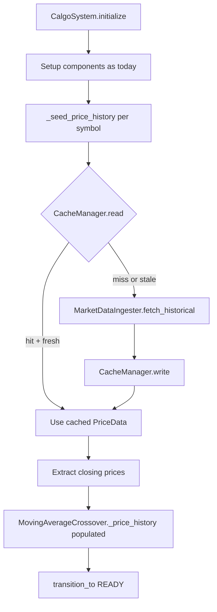

# Design Document: Historical Data Cache

## Overview

The historical data cache feature eliminates the cold-start warm-up delay for the `MovingAverageCrossover` model. Currently, every restart requires accumulating `long_window` (default: 50) live ticks before any signal can be generated — at a 5-minute fetch interval that is over 4 hours of silence. This feature adds a disk-backed JSON cache layer and a startup seeding step so the model is ready to generate signals immediately.

The design introduces three focused changes:

1. A new `CacheManager` class (`src/cache_manager.py`) that handles reading, writing, and staleness detection for per-symbol JSON cache files.
2. A new `CacheConfig` dataclass added to `src/config_models.py` and wired into the existing `Config` container.
3. A `_seed_price_history()` method added to `CalgoSystem` that is called at the end of `initialize()`, after all models are set up, to pre-populate each model's `_price_history` before the system transitions to `READY`.

---

## Architecture



The cache sits between `CalgoSystem` and `MarketDataIngester`. It is consulted once per symbol at startup; it is never consulted during the live trading loop.

---

## Components and Interfaces

### CacheManager (`src/cache_manager.py`)

```python
class CacheManager:
    def __init__(self, config: CacheConfig) -> None: ...

    def read(self, symbol: str) -> Result[CacheEntry | None, CacheError]:
        """Return CacheEntry if file exists and is parseable, None on miss, Err on corrupt."""

    def write(self, symbol: str, records: List[PriceData]) -> Result[None, CacheError]:
        """Serialize records to disk, creating directories as needed."""

    def is_stale(self, entry: CacheEntry) -> bool:
        """True when the most recent record's date is before today, or entry is empty."""
```

`CacheManager` is stateless beyond its config; every call opens and closes the file. This keeps it simple and easy to test.

### CacheConfig (`src/config_models.py`)

```python
@dataclass
class CacheConfig:
    cache_directory: str = "./cache/historical"
    max_age_days: int = 1
```

Added as an optional field on the existing `Config` dataclass with a default instance so existing configs that omit `cache_config` continue to work.

### CalgoSystem changes (`src/calgo_system.py`)

`initialize()` gains one call at the end of the model-setup block:

```python
symbols = self._config_manager.get_trading_symbols()
self._seed_price_history(symbols)
```

`_seed_price_history(symbols)` is a new private method:

```python
def _seed_price_history(self, symbols: List[str]) -> None:
    for symbol in symbols:
        entry_result = self._cache_manager.read(symbol)
        if entry_result.is_ok():
            entry = entry_result.unwrap()
            if entry is None or self._cache_manager.is_stale(entry):
                entry = self._fetch_and_cache(symbol)
        else:
            entry = self._fetch_and_cache(symbol)

        if entry:
            self._inject_price_history(symbol, entry.records)
```

`_fetch_and_cache(symbol)` calls `MarketDataIngester.fetch_historical()` with the computed lookback window, writes the result to cache, and returns the entry (or `None` on failure, after logging a warning).

`_inject_price_history(symbol, records)` extracts closing prices from the most recent `long_window` records and writes them directly into each `MovingAverageCrossover` model's `_price_history[symbol]`.

### ConfigurationManager changes (`src/config_manager.py`)

A new `get_cache_config() -> CacheConfig` method reads the optional `cache_config` section and returns defaults when absent.

---

## Data Models

### CacheEntry

```python
@dataclass
class CacheEntry:
    symbol: str
    fetched_at: datetime          # when the cache file was written
    records: List[PriceData]      # ascending by timestamp
```

### On-disk JSON format

```json
{
  "symbol": "AAPL",
  "fetched_at": "2025-07-01T09:00:00",
  "record_count": 100,
  "records": [
    {
      "symbol": "AAPL",
      "timestamp": "2025-06-01T00:00:00",
      "open": "189.50",
      "high": "191.20",
      "low": "188.90",
      "close": "190.75",
      "volume": 54321000,
      "source": "alpaca"
    }
  ]
}
```

All price fields are stored as decimal strings to avoid floating-point precision loss. Timestamps are ISO 8601 strings. The `record_count` field is a convenience for quick inspection without parsing the full array.

### CacheConfig (in config.json)

```json
{
  "cache_config": {
    "cache_directory": "./cache/historical",
    "max_age_days": 1
  }
}
```

The section is optional; omitting it applies the defaults above.

### Lookback window calculation

```
lookback_days = long_window * lookback_multiplier   (default multiplier = 2)
start_date    = today - timedelta(days=lookback_days)
end_date      = today
```

With the default `long_window=50` and multiplier `2`, the system requests 100 calendar days, which reliably yields at least 50 trading days after weekends and holidays are excluded.

---

## Correctness Properties

*A property is a characteristic or behavior that should hold true across all valid executions of a system — essentially, a formal statement about what the system should do. Properties serve as the bridge between human-readable specifications and machine-verifiable correctness guarantees.*


### Property 1: Serialization round-trip

*For any* valid list of `PriceData` records, calling `CacheManager.write(symbol, records)` followed by `CacheManager.read(symbol)` shall return a list of records equivalent to the original (same symbol, timestamp, prices, volume, and source for every element, in the same order).

**Validates: Requirements 2.5, 7.4**

### Property 2: Serialized record field completeness

*For any* `PriceData` record written to a cache file, the corresponding JSON object shall contain all required fields — `symbol`, `timestamp` (ISO 8601 string), `open`, `high`, `low`, `close` (decimal strings), `volume` (integer), and `source` — with no missing or null values.

**Validates: Requirements 7.2**

### Property 3: Cache file metadata fields

*For any* symbol and any non-empty list of `PriceData` records written by `CacheManager.write()`, the resulting JSON file shall contain a top-level object with `symbol`, `fetched_at`, `record_count`, and `records` fields, where `record_count` equals the length of `records`.

**Validates: Requirements 1.4, 7.3**

### Property 4: Cache files written to configured directory

*For any* `CacheConfig` with a given `cache_directory` and any symbol, after `CacheManager.write()` succeeds the cache file shall exist at `{cache_directory}/{SYMBOL}.json`.

**Validates: Requirements 1.2, 6.1**

### Property 5: Staleness detection respects max_age_days

*For any* `CacheEntry` and any `max_age_days` value, `CacheManager.is_stale(entry)` shall return `True` when the most recent record's date is more than `max_age_days` days before the current date, and `False` when it is within that threshold.

**Validates: Requirements 3.2, 6.2**

### Property 6: Stale or missing cache triggers a network fetch

*For any* symbol where `CacheManager.read()` returns `None` (miss) or `is_stale()` returns `True`, `CalgoSystem._seed_price_history()` shall call `MarketDataIngester.fetch_historical()` exactly once for that symbol.

**Validates: Requirements 3.3, 4.4**

### Property 7: Fresh cache skips network fetch

*For any* symbol where `CacheManager.read()` returns a non-stale `CacheEntry`, `CalgoSystem._seed_price_history()` shall not call `MarketDataIngester.fetch_historical()` for that symbol.

**Validates: Requirements 4.3**

### Property 8: Seeding injects the correct closing prices

*For any* dataset of N `PriceData` records and a model with `long_window` L, after `_seed_price_history()` the model's `_price_history[symbol]` shall contain exactly `min(N, L)` entries equal to the closing prices of the most recent `min(N, L)` records, ordered ascending by timestamp.

**Validates: Requirements 4.2, 4.6, 5.3**

### Property 9: Lookback date range covers sufficient calendar days

*For any* `long_window` value L and lookback multiplier M, the `start_date` passed to `MarketDataIngester.fetch_historical()` during seeding shall be at least `L * M` calendar days before the current date.

**Validates: Requirements 5.1, 5.2**

---

## Error Handling

| Scenario | Component | Behavior |
|---|---|---|
| Cache directory does not exist | `CacheManager.write` | Create directory tree, then write |
| Cache file is corrupt / invalid JSON | `CacheManager.read` | Return `Err(CacheError)`, treat as miss |
| Write fails (permissions, disk full) | `CacheManager.write` | Return `Err(CacheError)`, leave existing file unchanged |
| `fetch_historical` fails for all sources | `CalgoSystem._fetch_and_cache` | Log warning, return `None`; seeding continues with zero records |
| Fewer than `long_window` records available | `CalgoSystem._inject_price_history` | Inject all available records, log shortfall at WARNING level |
| `cache_config` absent from config.json | `ConfigurationManager.get_cache_config` | Return `CacheConfig()` with defaults, no error |
| Configured cache directory is inaccessible | `CacheManager.__init__` | Return `Err(CacheError)` with descriptive message |

All errors from `CacheManager` are non-fatal to system startup. A cache failure degrades to the pre-feature behavior (no seeding or network fetch), never prevents the system from reaching `READY`.

---

## Testing Strategy

### Unit tests

Focus on specific examples, edge cases, and error conditions:

- `CacheManager.read()` returns `None` for a missing file
- `CacheManager.read()` returns `Err` for a corrupt file
- `CacheManager.write()` creates the directory when it does not exist
- `CacheManager.is_stale()` returns `True` for an empty records list
- `CalgoSystem._seed_price_history()` logs a warning and continues when fetch fails
- `CalgoSystem._seed_price_history()` injects all records when N < `long_window`
- `ConfigurationManager.get_cache_config()` returns defaults when `cache_config` is absent

### Property-based tests

Use [Hypothesis](https://hypothesis.readthedocs.io/) (already present in the project via `.hypothesis/`) with a minimum of 100 iterations per property.

Each test is tagged with a comment in the format:
`# Feature: historical-data-cache, Property {N}: {property_text}`

| Property | Test description |
|---|---|
| P1 — Round-trip | Generate random `List[PriceData]`, write then read, assert equivalence |
| P2 — Record field completeness | Generate random `PriceData`, write, parse JSON, assert all fields present and correctly typed |
| P3 — Metadata fields | Generate random records list, write, parse JSON, assert top-level fields and `record_count` |
| P4 — Configured directory | Generate random temp dir path and symbol, write, assert file at expected path |
| P5 — Staleness detection | Generate random `CacheEntry` with varying timestamps and `max_age_days`, assert `is_stale()` matches expected |
| P6 — Stale triggers fetch | Mock `CacheManager` to return stale/None, assert `fetch_historical` called once per symbol |
| P7 — Fresh skips fetch | Mock `CacheManager` to return fresh entry, assert `fetch_historical` not called |
| P8 — Correct records injected | Generate datasets of varying size relative to `long_window`, assert injected history matches expected slice |
| P9 — Lookback date range | Generate random `long_window` and multiplier values, assert computed `start_date` is sufficiently early |

Property tests complement unit tests: unit tests catch concrete bugs in specific scenarios, property tests verify the general correctness of the serialization, staleness, and seeding logic across the full input space.
