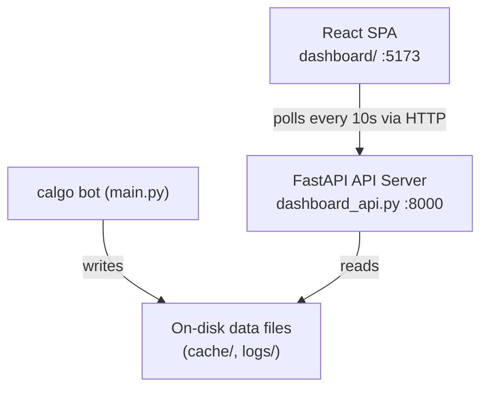

# Design Document: Trading Dashboard

## Overview

The Trading Dashboard is a local developer tool that provides near real-time observability into the calgo trading bot. It consists of two components:

- **API Server** (`dashboard_api.py`): A FastAPI application that reads calgo's on-disk data files and exposes them as REST endpoints on port 8000.
- **React Frontend** (`dashboard/`): A Vite-bootstrapped SPA that polls the API every 10 seconds and renders price charts, signals, trades, portfolio snapshots, and system logs.

The system is read-only — it never writes to calgo's data files. No authentication is required since this is a local development tool.

## Architecture



The API server is stateless — every request reads directly from disk. There is no in-memory cache or database. The React frontend manages all UI state and drives polling via `setInterval`.

## Components and Interfaces

### API Server (`dashboard_api.py`)

Built with FastAPI. All routes are prefixed with `/api`. CORS is configured to allow all origins.

**Endpoints:**

| Method | Path | Description |
|--------|------|-------------|
| GET | `/api/health` | Health check with server timestamp |
| GET | `/api/symbols` | List symbols with cached price data |
| GET | `/api/dates` | Available dates per log type |
| GET | `/api/price-history/{symbol}` | OHLCV records for a symbol |
| GET | `/api/signals[/{date}]` | Signal entries for a date (default: today) |
| GET | `/api/trades[/{date}]` | Trade entries for a date (default: today) |
| GET | `/api/portfolio[/{date}]` | Portfolio snapshots for a date (default: today) |
| GET | `/api/logs[/{date}]` | Log entries for a date, with optional `?severity=` filter |

**File reading helpers** (internal):

- `read_json_file(path) -> list | dict | None` — reads and parses a JSON file; returns `None` on missing, raises on corrupt
- `list_dated_files(log_dir) -> list[str]` — scans a `logs/` subdirectory and returns sorted date strings derived from `{date}.json` filenames
- `sort_by_timestamp(entries) -> list` — sorts a list of dicts by their `"timestamp"` field ascending

### React Frontend (`dashboard/`)

Bootstrapped with Vite + React. Styled with Tailwind CSS. Charts use Recharts.

**Component tree:**

```
App
├── Header (symbol selector, date picker, polling indicator)
├── PriceChart (Recharts LineChart of close prices)
├── SignalsTable
├── TradesTable
├── PortfolioPanel (most recent snapshot)
└── LogsPanel (scrollable, severity-colored rows)
```

**Custom hooks:**

- `usePolling(fetchFn, intervalMs)` — calls `fetchFn` on mount and every `intervalMs` ms; returns `{ data, error, loading }`
- `useSymbols()` — fetches `/api/symbols`
- `useDates()` — fetches `/api/dates`
- `usePriceHistory(symbol)` — fetches `/api/price-history/{symbol}`
- `useSignals(date)` — fetches `/api/signals/{date}`
- `useTrades(date)` — fetches `/api/trades/{date}`
- `usePortfolio(date)` — fetches `/api/portfolio/{date}`
- `useLogs(date)` — fetches `/api/logs/{date}`

All hooks share the same `usePolling` base and default to a 10-second interval. Poll errors are surfaced as a non-blocking toast/banner without stopping the interval.

**API client (`dashboard/src/api.js`):**

Thin wrapper around `fetch` with a base URL of `http://localhost:8000`. Each function maps to one endpoint.

## Data Models

### On-disk formats (read by API)

**`cache/historical/{SYMBOL}.json`**
```json
{
  "symbol": "AAPL",
  "fetched_at": "2026-03-14T03:39:22.104666",
  "record_count": 68,
  "records": [
    {
      "symbol": "AAPL",
      "timestamp": "2025-12-04T00:00:00",
      "open": "284.0950",
      "high": "284.7300",
      "low": "278.5900",
      "close": "280.7000",
      "volume": 43989056,
      "source": "alpha_vantage"
    }
  ]
}
```

**`logs/signals/{date}.json`** — JSON array of signal objects:
```json
{
  "symbol": "AAPL",
  "timestamp": "2026-03-13T20:42:00+00:00",
  "recommendation": "hold",
  "confidence": 0.3,
  "model_id": "ma_crossover_v1",
  "metadata": { "reason": "insufficient_data", "data_points": 1, "required": 50 }
}
```

**`logs/errors/{date}.json`** — JSON array of log entries:
```json
{
  "timestamp": "2026-03-14T03:35:07.651658",
  "severity": "INFO",
  "component": "CalgoSystem",
  "message": "Trading loop interrupted by user"
}
```

**`logs/trades/{date}.json`** and **`logs/portfolio/{date}.json`** follow the same date-keyed array pattern.

### API response shapes

`GET /api/health`:
```json
{ "status": "ok", "timestamp": "2026-03-14T10:00:00.000000" }
```

`GET /api/symbols`:
```json
["AAPL", "GOOGL", "MSFT"]
```

`GET /api/dates`:
```json
{
  "signals": ["2026-03-13"],
  "trades": [],
  "portfolio": [],
  "errors": ["2026-03-14", "2026-03-13"]
}
```

`GET /api/price-history/{symbol}` — passes through the full cache file JSON as-is.

`GET /api/signals/{date}`, `/api/trades/{date}`, `/api/portfolio/{date}`, `/api/logs/{date}` — return sorted JSON arrays of the respective entry objects. `/api/logs` additionally supports `?severity=WARNING` filtering.

## Correctness Properties

*A property is a characteristic or behavior that should hold true across all valid executions of a system — essentially, a formal statement about what the system should do. Properties serve as the bridge between human-readable specifications and machine-verifiable correctness guarantees.*

### Property 1: Symbol case normalization

*For any* symbol string (mixed case or lowercase), the `/api/symbols` response and the `/api/price-history/{symbol}` response SHALL contain the symbol in uppercase.

**Validates: Requirements 1.4, 6.2**

### Property 2: Missing file returns safe default

*For any* date string for which no log file exists, the signals, trades, portfolio, and logs endpoints SHALL return an empty JSON array (not a 4xx or 5xx error).

**Validates: Requirements 2.3, 3.3, 4.3, 5.3**

### Property 3: Timestamp sort order

*For any* non-empty log file (signals, trades, portfolio, logs), the entries returned by the API SHALL be sorted in ascending timestamp order — i.e., for every consecutive pair of entries `(a, b)`, `a.timestamp <= b.timestamp`.

**Validates: Requirements 2.4, 3.4, 4.4, 5.5**

### Property 4: Severity filter is a subset

*For any* date and any severity value `s`, the entries returned by `/api/logs/{date}?severity=s` SHALL be a subset of the entries returned by `/api/logs/{date}` with no severity filter, and every entry in the filtered result SHALL have `severity == s`.

**Validates: Requirements 5.4**

### Property 5: Dates derived from filenames

*For any* set of files present in a `logs/` subdirectory following the `{YYYY-MM-DD}.json` naming convention, the dates returned by `/api/dates` for that log type SHALL exactly match the set of date strings derivable from those filenames, sorted in descending order.

**Validates: Requirements 7.2, 7.3**

### Property 6: Health response contains timestamp

*For any* call to `/api/health`, the response SHALL contain a `"timestamp"` field whose value is a valid ISO 8601 datetime string.

**Validates: Requirements 15.2**

### Property 7: Polling does not block interaction

*For any* polling interval configuration, a failed poll request SHALL not prevent subsequent poll attempts from being scheduled — i.e., the interval continues regardless of individual request outcomes.

**Validates: Requirements 14.4**

## Error Handling

**API Server:**

| Condition | Behavior |
|-----------|----------|
| Cache file missing (`/api/price-history/{symbol}`) | HTTP 404 with `{"detail": "No price data found for symbol '{symbol}'"}` |
| Cache file corrupt (invalid JSON) | HTTP 500 with `{"detail": "Failed to parse price data for '{symbol}'"}` |
| Log file missing (signals/trades/portfolio/logs) | HTTP 200 with `[]` |
| Log file corrupt | HTTP 200 with `[]` and a server-side warning log (fail-open to avoid breaking the dashboard) |
| Unexpected server error | FastAPI default 500 handler |

The decision to return `[]` on corrupt log files (rather than 500) is intentional: the dashboard should remain usable even if one day's log file is malformed.

**React Frontend:**

- Poll errors are caught per-hook and stored in the `error` field returned by `usePolling`.
- `App` renders a dismissible banner when any hook has a non-null error.
- The banner does not block the rest of the UI.
- Polling continues on the next interval regardless of errors.
- Empty states (no data returned) render a descriptive message inside each panel rather than leaving it blank.

## Testing Strategy

### Unit Tests (pytest, backend)

Focus on specific examples and edge cases:

- `GET /api/price-history/aapl` returns uppercase symbol in response
- `GET /api/price-history/UNKNOWN` returns 404
- `GET /api/signals/9999-01-01` (no file) returns `[]`
- `GET /api/logs/{date}?severity=WARNING` returns only WARNING entries
- `GET /api/dates` returns dates in descending order
- `GET /api/health` returns 200 with a `timestamp` field
- Corrupt JSON file for price history returns 500
- Corrupt JSON file for logs returns `[]`

Use `pytest` with `httpx.AsyncClient` and `fastapi.testclient.TestClient`. Mock the filesystem with `tmp_path` fixtures.

### Property-Based Tests (Hypothesis, backend)

Use `hypothesis` (already present in the project). Minimum 100 iterations per property.

Each test is tagged with a comment referencing the design property:
```
# Feature: trading-dashboard, Property {N}: {property_text}
```

**Property 1 test** — generate random symbol strings of mixed case; assert response symbol is uppercase.

**Property 2 test** — generate random date strings that have no corresponding file; assert all four log endpoints return `[]`.

**Property 3 test** — generate lists of entry dicts with random ISO timestamps; write to a temp file; assert API response is sorted ascending by timestamp.

**Property 4 test** — generate a list of log entries with random severity values drawn from `{INFO, WARNING, ERROR}`; write to temp file; for each severity value, assert filtered response is a subset of unfiltered and all entries match the severity.

**Property 5 test** — generate a random set of `YYYY-MM-DD` date strings; create corresponding `.json` files in a temp directory; assert `/api/dates` returns exactly those dates in descending order.

**Property 6 test** — call `/api/health` with generated server states; assert `timestamp` is always present and parseable as ISO 8601.

### Frontend Tests (Vitest + React Testing Library)

- `usePolling` hook: assert fetch is called on mount and re-called after interval; assert error state is set on fetch failure without stopping the interval.
- `PriceChart`: given mock price records, assert a `<svg>` is rendered.
- `LogsPanel`: given entries of mixed severity, assert INFO/WARNING/ERROR rows have distinct CSS classes.
- Empty state: given `[]` data, assert descriptive message is rendered in each panel.

Run with: `vitest --run`
